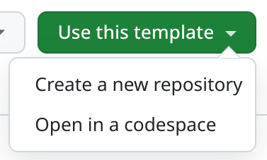
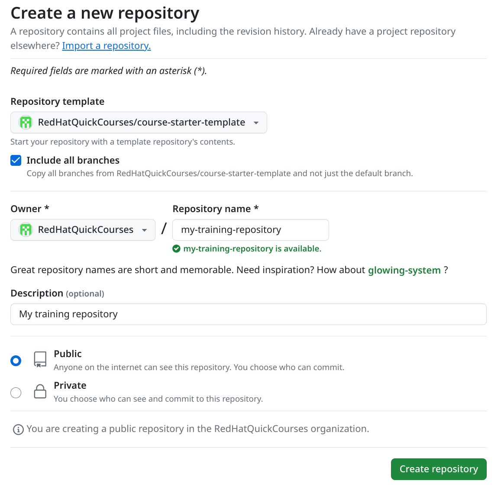
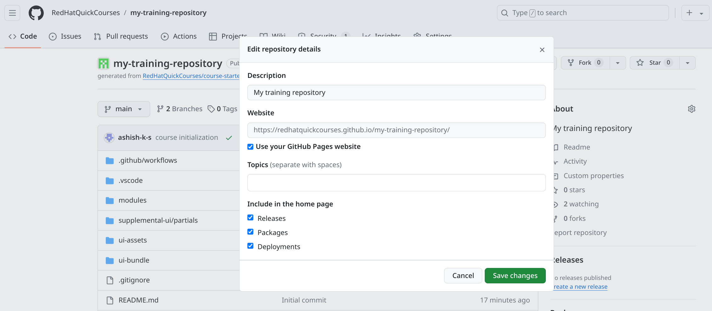
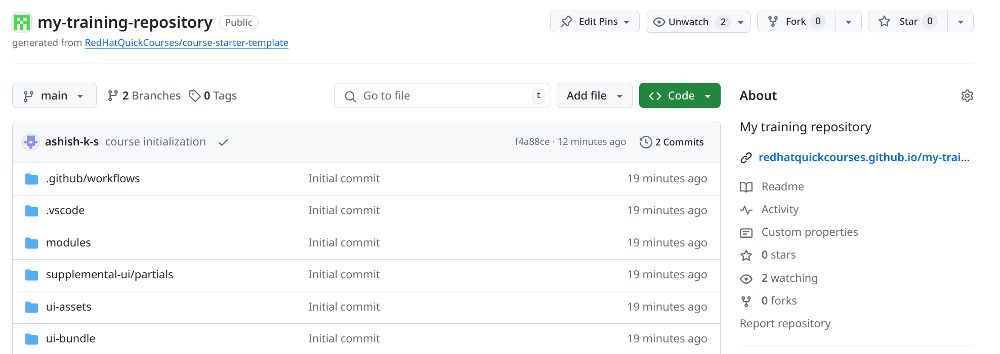

# Governing AI Data Workflows: AutoML and AutoRAG Strategies

> ⚠️ **Work in progress (WIP).** This course is under active development. Chapter and section pages are currently scaffolded outlines — content is incomplete and subject to change, and page bodies still carry `Not started yet` warnings. Do not treat this material as final or publish it externally yet.

## About this course

This course teaches technical professionals how to strategically evaluate use cases and apply **AutoML** (predictive modeling) and **AutoRAG** (generative retrieval) in **Red Hat OpenShift AI 3.5+** to drive measurable business value.

It focuses on the practitioner experience — the Data Scientist and AI Engineer platform capabilities — rather than infrastructure management. As the first entry in the **Connecting Data to Models and Agents** enablement series, it emphasizes terminology, best practices, and business value using diagrams, Summit Arcade interactive clickthroughs, and video walkthroughs. **No hands-on user labs are required.**

### Target audience

- **Primary personas:** Data Scientists, AI Engineers, and Technical Solution Architects evaluating or adopting Red Hat OpenShift AI 3.5+.
- **Technical level (TL2):** Technical practitioners and field specialists who want to understand the "why", decision points, trade-offs, and business outcomes of automated capabilities — without performing cluster admin setup.
- **Distribution:** Publicly discoverable enablement for global Red Hat field teams, ecosystem partners, and enterprise customers.

## Course outline

| # | Chapter | Focus |
|---|---------|-------|
| 1 | Predictive Foundations with AutoML | When to apply AutoML to turn raw tabular/time-series data into production-ready predictive models. |
| 2 | Validating and Deploying AutoML Models | Using leaderboards, feature importance, and ROC/PR curves to validate and promote winning models to production. |
| 3 | Prompt Engineering and MLflow Governance | Moving from predictive data to generative text; versioning prompts and eliminating "prompt drift" with MLflow. |
| 4 | Optimizing Retrieval with AutoRAG | Benchmarking chunking, embedding, and vector database configurations for grounded LLM applications. |
| 5 | Knowledge Review and Assessment | End-to-end synthesis of AutoML, MLflow, and AutoRAG, plus a scenario-based graded quiz. |

## Status

| Item | State |
|------|-------|
| Course structure & navigation | ✅ Scaffolded |
| Chapter/section outlines | ✅ Drafted from course design |
| Page content | 🚧 In progress (`Not started yet`) |
| Interactive assets (Arcade, video, quiz) | 🚧 Pending |
| Review & sign-off | ⬜ Not started |

The authoritative design lives in [`prompts/course_design.md`](./prompts/course_design.md).

## Previewing the course locally

This is an [Antora](https://antora.org/) course. To build and preview:

```
npm install

# Build once
npm run build

# Or watch for changes and serve a live preview
npm run watch:adoc   # rebuilds on edits to ./modules
npm run serve        # serves build/site (see the printed URL)
```

Generate a PDF with `npm run generate-pdf`.

## Development

- [Getting started with the training template](#getting-started-with-a-new-training-content-repository) (below)
- [Development using devspace](./DEVSPACE.md)
- [Guideline for editing your content](./USAGEGUIDE.adoc)

---

## Getting started with a new training content repository

- Open the [course-starter-template](https://github.com/RedHatQuickCourses/course-starter-template)

- Click on `Use This template` button and select `Create a new repository` option.



- On `Create a new repository` page, Select the options as highlighted in the below image and then click `Create repository` button at the bottom of the page.



- Clone this repository on your local system:
```
git clone git@github.com:RedHatQuickCourses/my-training-repository.git
```
NOTE: Use your repository url in the above command.

- Go in to the course repository directory and initialize the course.
``` 
cd my-training-repository/
sh course-init.sh --type bfx --lab demo
```
NOTE: If you are using Mac, use *zsh* in place of *sh* in the above command.

Sample output:
```
Initializing my-training-repository . . . done

Please replace the specified strings in the files below and commit the changes before proceeding with the course development.
antora.yml:title: REPLACE Course Title
```

- Edit the files prompted by course initialization script.

- Commit the changes done by course initialization script and your manual edits.
```
 git status 
 git add -A; git commit -m "course initialization"
 git push origin main 
```

- Browse your git repository url 

- On your github repo page, on left hand side pane, click on settings gear icon near `About` heading.

- Click `Use your GitHub Pages website` option to select (checked) it and then click `Save changes` button.



- You should now see the link to access the rendered content within that same block.



FIXME: highlight the relevant area on images.
